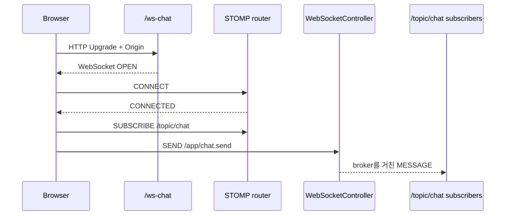

<a id="seq-08"></a>

# Realtime Communication 이론 정리

## 1. 새 메시지를 보려고 계속 새로고침해야 할까?

HTTP 요청/응답은 응답을 받으면 한 흐름이 끝납니다.
채팅처럼 새 데이터가 자주 생기는 화면에서는 WebSocket transport를 열어 두고 같은 연결에서 메시지를 주고받을 수 있습니다.

STOMP는 WebSocket 위에서 `CONNECT`, `SUBSCRIBE`, `SEND`, `MESSAGE` frame과 destination을 구분하는 메시징 규칙입니다.

## 2. OPEN, CONNECTED, SUBSCRIBE 전송은 같은 상태가 아닙니다

1. 허용된 Origin의 HTTP Upgrade가 `/ws-chat`에서 성공하면 WebSocket이 `OPEN` 됩니다.
2. 브라우저가 STOMP `CONNECT` frame을 보내고 `CONNECTED`를 받아야 messaging session이 준비됩니다.
3. `SUBSCRIBE destination:/topic/chat`을 보내야 topic 등록을 요청할 수 있습니다. main 데모는 STOMP receipt를 요청하지 않으므로 frame 전송 직후 등록 완료를 확정하지 않습니다.
4. `/app/chat.send`의 `SEND`는 application handler로 향합니다.
5. handler가 `/topic/chat`으로 낸 결과는 broker가 현재 구독 session에만 `MESSAGE`로 전달합니다.



| 단계 | 들어온 것 | 한 일 | 나간 것 또는 상태 |
|---|---|---|---|
| 1 | Upgrade 요청과 Origin | 허용 Origin을 확인 | 허용되면 `/ws-chat` handshake 진행 |
| 2 | handshake 성공 | WebSocket transport를 생성 | `OPEN` |
| 3 | STOMP `CONNECT` | messaging session을 협상 | `CONNECTED` |
| 4 | `/topic/chat` `SUBSCRIBE` | topic 등록 frame 전송 | receipt 없음 · 등록 완료는 아직 미확정 |
| 5 | `/app/chat.send` `SEND` | `@MessageMapping` handler를 선택 | `ChatMessage` 처리 |
| 6 | handler 결과 | `@SendTo("/topic/chat")`로 broker에 전달 | topic message 준비 |
| 7 | 현재 subscription 집합 | broker가 session별로 fan-out | 구독 session만 `MESSAGE` 수신 |

연결된 session 수가 아니라 `/topic/chat` subscription 집합이 실제 수신자를 결정합니다. 다만 현재 브라우저가 그 내부 집합을 직접 읽지는 않으며, 두 탭에서 실제 `MESSAGE`를 받은 결과가 구독이 동작했다는 수동 간접 증거입니다.

## 3. main 데모는 native WebSocket을 사용합니다

`main`의 데모는 외부 클라이언트 라이브러리나 SockJS를 사용하지 않고 STOMP frame을 직접 만듭니다.
WebSocket `open`만으로 Send 버튼을 열지 않고, `CONNECTED` frame을 받은 뒤 자동 구독합니다.

```javascript
socket = new WebSocket(`${protocol}://${window.location.host}/ws-chat`);
socket.addEventListener("open", () => {
  sendFrame("CONNECT", { "accept-version": "1.2", host: window.location.host });
});
if (frame.startsWith("CONNECTED")) {
  sendFrame("SUBSCRIBE", { id: "chat-subscription", destination: "/topic/chat" });
}
```

실행 전에는 transport와 messaging 상태가 모두 준비되지 않았고, `OPEN` 뒤에는 통로만 열립니다. `CONNECTED` 뒤 main 데모가 `SUBSCRIBE` frame을 보내지만 receipt가 없으므로 UI가 확정할 수 있는 상태는 ‘구독 요청 전송’까지입니다. 이후 실제 `MESSAGE` 수신으로 topic 등록 동작을 수동 확인합니다.

서버 handler는 application destination의 메시지를 topic 결과로 바꿉니다.

```kotlin
@MessageMapping("/chat.send")
@SendTo("/topic/chat")
fun send(message: ChatMessage): ChatMessage {
    return message
}
```

handler 호출 전에는 `/app/chat.send` payload이고, 반환 뒤에는 broker가 `/topic/chat` 구독자에게 보낼 payload가 됩니다.

## 4. 실패 경계는 messaging보다 앞에도 있습니다

- Origin이 허용 패턴과 맞지 않으면 handshake에서 멈추므로 WebSocket session과 STOMP session이 생기지 않습니다.
- WebSocket이 `OPEN`이어도 `CONNECTED` 전에는 main 데모의 Send 버튼이 비활성입니다.
- `CONNECTED`여도 `/topic/chat`을 구독하지 않은 session은 해당 topic의 `MESSAGE`를 받지 않습니다.
- Origin allowlist는 접속 출처를 제한할 뿐 사용자 신원과 권한을 확인하는 인증·인가가 아닙니다.

## 5. 자동 테스트와 수동 증거를 구분합니다

```bash
docker compose up -d
./gradlew test
./gradlew bootRun
```

자동 테스트가 데모 페이지 접근을 확인해도 STOMP connect·subscribe·send·receive 왕복까지 증명하지는 않습니다.
브라우저 화면에서는 parsed message를 확인하고 raw `MESSAGE` frame은 DevTools에서 따로 확인합니다.

## 6. 다음 질문

현재 공개 endpoint와 `permitAll`은 실습 범위입니다.
운영에서는 인증된 WebSocket session, destination별 권한, 재연결, 메시지 저장과 broker 확장 정책을 별도로 설계해야 합니다.

[Visual Lab에서 입력 조건을 보고 경로 예측하기](./visual-lab/sequences/08/)
