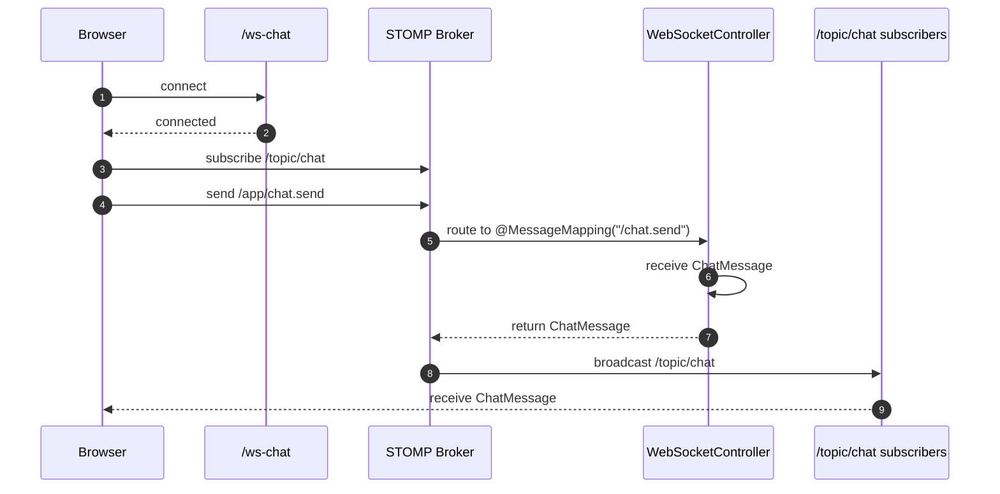
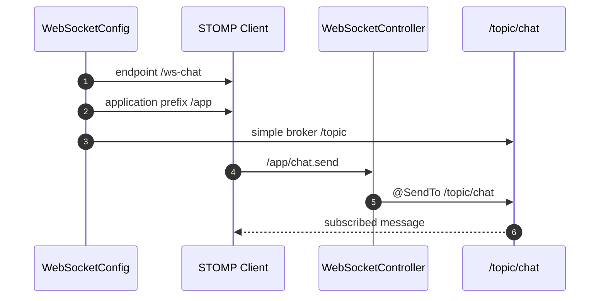

# 이론 정리

> 이번 시퀀스는 HTTP 요청/응답을 넘어 WebSocket과 STOMP로 연결, 구독, 발행, broadcast 흐름을 확인하는 단계입니다.
> 이 브랜치에서는 완성된 `WebSocketConfig`, `WebSocketController`, `ChatMessage`, `realtime-demo.html`을 기준으로 메시지가 어디서 시작해 어떤 topic으로 돌아오는지 비교합니다.

## 1. Problem - 왜 실시간 통신이 필요한가

HTTP는 클라이언트가 요청하고 서버가 응답하는 구조입니다. 게시글 조회, 로그인, 캐시 조회처럼 요청 단위가 분명한 기능에는 잘 맞습니다.

채팅이나 알림처럼 서버가 연결된 화면에 다시 메시지를 보내야 하는 기능은 요청/응답 한 번으로 설명하기 어렵습니다. 클라이언트가 반복 조회로 새 메시지를 확인할 수도 있지만, 이번 시퀀스의 목표는 연결을 유지한 상태에서 서버가 topic 구독자에게 다시 보내는 흐름을 보는 것입니다.

정답 구현은 아래 문제를 가장 작은 형태로 해결합니다.

- 브라우저가 `/ws-chat` endpoint에 연결합니다.
- 브라우저가 `/topic/chat`을 구독합니다.
- 브라우저가 `/app/chat.send`로 메시지를 보냅니다.
- 서버가 `ChatMessage`를 받고 `/topic/chat`으로 다시 보냅니다.
- 구독 중인 브라우저가 broadcast 메시지를 받습니다.

## 2. Analyze - 정답 구현에서 선택한 경로 기준

| 구분 | 정답 구현의 값 | 역할 |
|---|---|---|
| 연결 endpoint | `/ws-chat` | 브라우저가 STOMP 연결을 시작합니다. |
| application prefix | `/app` | 클라이언트가 서버 handler로 보낼 때 붙는 prefix입니다. |
| message mapping | `/chat.send` | controller 메서드가 받을 목적지입니다. |
| send destination | `/app/chat.send` | 클라이언트가 실제로 보내는 경로입니다. |
| broker topic prefix | `/topic` | 서버가 구독자에게 보낼 topic prefix입니다. |
| subscribe topic | `/topic/chat` | 브라우저가 메시지를 받기 위해 구독합니다. |

이 기준을 나누면 `@MessageMapping("/chat.send")`가 왜 `/app/chat.send`와 연결되는지, `@SendTo("/topic/chat")`이 왜 구독자에게 돌아가는지 설명할 수 있습니다.

## 3. API / 실행 시퀀스 다이어그램

### 3.1 connect / subscribe / send / receive 흐름

정답 구현의 controller는 메시지를 DB에 저장하지 않고 받은 메시지를 그대로 반환합니다. 이 반환값이 `@SendTo("/topic/chat")`에 의해 topic 구독자에게 전달됩니다.

### 3.2 설정과 controller 연결 흐름

`/app`과 `/topic`은 서로 다른 역할입니다. `/app`은 서버로 보내는 경로이고, `/topic`은 서버가 다시 보내는 경로입니다.

## 4. 계층 / DTO / 메시지 흐름

### 4.1 WebSocket 계층 흐름

| 계층 | 정답 구현에서 확인할 책임 | 주요 파일 |
|---|---|---|
| Client page | connect, subscribe, send, receive를 화면에서 확인합니다. | `realtime-demo.html` |
| WebSocket config | endpoint, broker prefix, application prefix를 설정합니다. | `WebSocketConfig.kt` |
| Controller | STOMP 메시지를 받고 topic으로 다시 보냅니다. | `WebSocketController.kt` |
| DTO | 실시간 메시지의 모양을 정합니다. | `ChatMessage.kt` |

### 4.2 DTO와 메시지 흐름

| 단계 | 메시지 형태 | 정답 구현에서 확인할 점 |
|---|---|---|
| 화면 입력 | sender, content | 데모 페이지에서 보낸 사람과 내용을 입력합니다. |
| 클라이언트 send | JSON `ChatMessage` | `/app/chat.send`로 보냅니다. |
| 서버 수신 | `ChatMessage` 객체 | `send(message: ChatMessage)`가 받습니다. |
| 서버 반환 | `ChatMessage` 객체 | controller가 받은 메시지를 반환합니다. |
| topic broadcast | JSON `ChatMessage` | `/topic/chat` 구독자에게 전달됩니다. |

## 5. Action - 정답 구현에서 비교할 코드 흐름

### 5.1 WebSocket 설정

`WebSocketConfig.kt`는 endpoint와 STOMP 경로 규칙을 연결합니다.

비교 포인트:

- `@EnableWebSocketMessageBroker`가 설정 클래스에 붙어 있나요?
- simple broker prefix가 `/topic`으로 열려 있나요?
- application destination prefix가 `/app`으로 설정되어 있나요?
- 테스트 페이지가 연결할 endpoint가 `/ws-chat`으로 등록되어 있나요?

### 5.2 메시지 controller

`WebSocketController.kt`는 클라이언트가 보낸 메시지를 받고, 같은 메시지를 topic으로 다시 보내는 최소 흐름을 보여줍니다.

비교 포인트:

- `@MessageMapping("/chat.send")`가 클라이언트 send destination과 연결되나요?
- `@SendTo("/topic/chat")`가 구독 topic과 일치하나요?
- 반환값이 `ChatMessage`라서 구독자가 같은 구조를 받을 수 있나요?

### 5.3 테스트 페이지

`realtime-demo.html`은 브라우저에서 연결, 구독, 발행, 수신을 확인하는 도구입니다.

비교 포인트:

- connect 후 `/topic/chat`을 구독하나요?
- send는 `/app/chat.send`로 보내나요?
- 수신 로그가 topic 메시지를 화면에 표시하나요?
- 두 탭을 열었을 때 broadcast 흐름을 확인할 수 있나요?

## 6. Result - 확인할 결과와 남은 한계

정답 구현 기준으로 아래를 확인합니다.

- 브라우저가 `/ws-chat` endpoint에 연결됩니다.
- 클라이언트가 `/topic/chat`을 구독합니다.
- 클라이언트가 `/app/chat.send`로 메시지를 보냅니다.
- controller가 `ChatMessage`를 받고 `/topic/chat`으로 다시 보냅니다.
- 구독 중인 브라우저가 broadcast 메시지를 받습니다.

남는 한계도 함께 봅니다.

- 메시지 저장, 채팅방 분리, 읽음 처리, 사용자 세션 추적은 이번 범위가 아닙니다.
- WebSocket 인증/인가 고급 설정은 이후 확장 대상입니다.
- simple broker는 학습용으로 적합하지만 운영 scale-out에는 별도 broker 전략이 필요할 수 있습니다.

## 7. 실무 포인트

- WebSocket은 연결 유지가 핵심이므로 연결 실패, 재연결, heartbeat도 운영에서는 중요합니다.
- `/app`과 `/topic` 역할을 섞으면 메시지가 controller에 도착하지 않거나 구독자가 받지 못할 수 있습니다.
- `@SendTo` 없이 반환만 하면 구독자에게 broadcast되지 않습니다.
- 메시지를 저장하지 않는 broadcast는 화면 표시에는 충분할 수 있지만 이력 조회는 보장하지 않습니다.
- 인증이 필요한 서비스에서는 WebSocket handshake와 메시지 권한 검증을 별도로 설계해야 합니다.
- 여러 서버 인스턴스에서 같은 topic을 쓰려면 simple broker만으로 충분한지 검토해야 합니다.

## 8. 용어 정리

### WebSocket

- 뜻
  클라이언트와 서버가 연결을 유지한 채 메시지를 주고받는 통신 방식입니다.
- 왜 중요한가
  서버가 연결된 클라이언트에게 다시 메시지를 보낼 수 있습니다.
- 이번 코드에서는 어디에 보이는가
  `WebSocketConfig.kt`, `/ws-chat`
- 짧은 상황 예시
  브라우저가 `/ws-chat`에 연결한 뒤 메시지를 계속 주고받습니다.

### STOMP

- 뜻
  WebSocket 위에서 메시지 목적지와 구독 흐름을 다루기 위한 메시징 프로토콜입니다.
- 왜 중요한가
  send destination과 subscribe topic을 명확히 나눌 수 있습니다.
- 이번 코드에서는 어디에 보이는가
  `/app`, `/topic`, `@MessageMapping`, `@SendTo`
- 짧은 상황 예시
  클라이언트는 `/app/chat.send`로 보내고 `/topic/chat`을 구독해 받습니다.

### MessageMapping

- 뜻
  클라이언트가 보낸 STOMP destination을 controller 메서드에 연결하는 annotation입니다.
- 왜 중요한가
  서버가 어떤 메시지를 어떤 메서드에서 처리할지 정합니다.
- 이번 코드에서는 어디에 보이는가
  `@MessageMapping("/chat.send")`
- 짧은 상황 예시
  `/app/chat.send`로 보낸 메시지가 `send(...)` 메서드로 들어옵니다.

### Topic

- 뜻
  여러 구독자가 같은 메시지를 받을 수 있는 메시지 채널입니다.
- 왜 중요한가
  서버가 같은 메시지를 연결된 여러 클라이언트에게 broadcast할 수 있습니다.
- 이번 코드에서는 어디에 보이는가
  `/topic/chat`, `@SendTo("/topic/chat")`
- 짧은 상황 예시
  두 브라우저 탭이 같은 topic을 구독하면 한쪽에서 보낸 메시지를 둘 다 받을 수 있습니다.

### Broadcast

- 뜻
  서버가 받은 메시지를 특정 topic 구독자들에게 다시 보내는 흐름입니다.
- 왜 중요한가
  요청한 한 명에게만 응답하는 HTTP와 다르게 여러 연결이 같은 메시지를 받을 수 있습니다.
- 이번 코드에서는 어디에 보이는가
  `@SendTo("/topic/chat")`, `realtime-demo.html`
- 짧은 상황 예시
  한 브라우저가 메시지를 보내면 topic을 구독 중인 다른 브라우저도 메시지를 받습니다.

## 9. 다음 구현으로 연결되는 지점

`docs/answer-guide.md`를 볼 때는 경로 문자열을 외우기보다 endpoint, send destination, subscribe topic, controller 반환값이 하나의 메시지 흐름으로 이어지는지 확인합니다. 다음 배포 시퀀스에서는 이런 연결이 실제 서버 환경에서 어떻게 유지되고 관찰되는지도 중요해집니다.

멘토용 설명 포인트

- starter 구현과 비교할 때 경로 문자열보다 각 경로의 역할을 먼저 설명하게 합니다.
- 멘티가 `return message`만 외우지 않도록 annotation, 반환값, 구독 topic의 관계를 함께 확인합니다.
- 메시지 저장이나 채팅방 분리 질문이 나오면 다음 확장 주제로 남기고 이번 범위에서는 broadcast 흐름만 검증합니다.
- 두 브라우저 탭으로 같은 topic을 구독하면 broadcast 개념이 더 분명해집니다.

