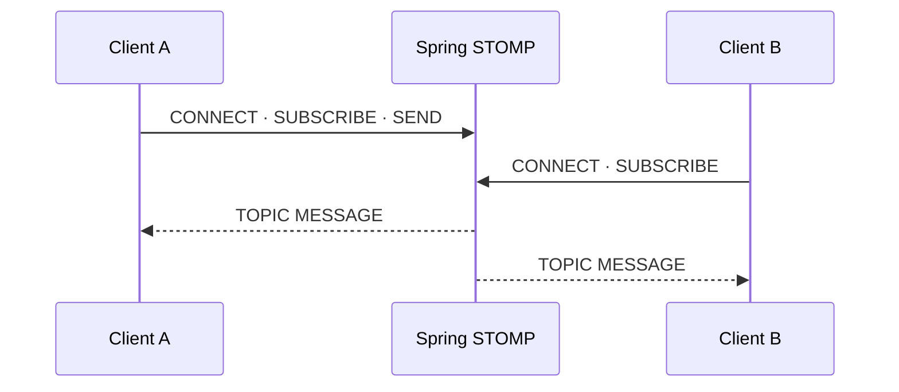

<a id="seq-08"></a>

# Realtime Communication 이론 가이드

## HTTP와 WebSocket

HTTP 요청/응답은 한 번의 요청에 한 번의 응답을 돌려주고 흐름을 마칩니다.
WebSocket은 연결을 유지하면서 같은 통로로 메시지를 계속 주고받습니다.

## WebSocket과 STOMP

WebSocket은 메시지가 이동할 transport입니다.
STOMP는 그 transport 위에서 `CONNECT`, `SUBSCRIBE`, `SEND`, `MESSAGE` frame과 destination을 구분합니다.

다음 상태는 서로 같지 않습니다.

1. WebSocket transport가 열립니다.
2. STOMP session이 준비됩니다.
3. client가 topic 구독을 요청합니다.
4. 구독한 session이 실제 `MESSAGE`를 받습니다.

구독 receipt가 없다면 `SUBSCRIBE` frame을 보냈다는 사실만으로 등록 완료를 단정하지 않습니다.
실제 메시지 수신은 구독이 동작했다는 수동 증거가 됩니다.

## Destination 역할

- WebSocket endpoint는 transport를 여는 입구입니다.
- application destination은 server handler로 메시지를 보냅니다.
- topic destination은 현재 구독한 session에 결과를 전달합니다.

메시지를 보낸 session과 메시지를 받는 session은 같을 필요가 없습니다.
broker는 발신자가 아니라 topic subscription 집합을 기준으로 수신자를 선택합니다.



| 단계 | 들어온 것 | 한 일 | 나간 것 또는 상태 |
|---|---|---|---|
| 연결 | WebSocket handshake | transport를 엽니다 | OPEN |
| session | STOMP CONNECT | messaging session을 준비합니다 | CONNECTED |
| 구독 | SUBSCRIBE | topic 수신 session을 등록합니다 | 구독 요청 전송 |
| 발행 | SEND와 payload | handler가 메시지를 처리합니다 | topic message |
| fan-out | topic message | 현재 구독자를 고릅니다 | MESSAGE |

메시지 모양은 다음 두 필드로 제한합니다.

```json
{
  "sender": "Client A",
  "content": "hello"
}
```

## 보안 경계

Origin 검사는 WebSocket handshake의 출처를 제한합니다.
사용자 신원과 destination 권한을 확인하는 인증·인가는 별도 정책입니다.

[Visual Lab에서 연결과 구독 조건 비교하기](./visual-lab/sequences/08/)
