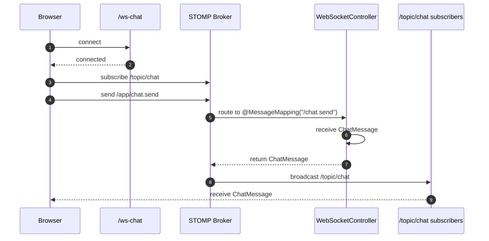
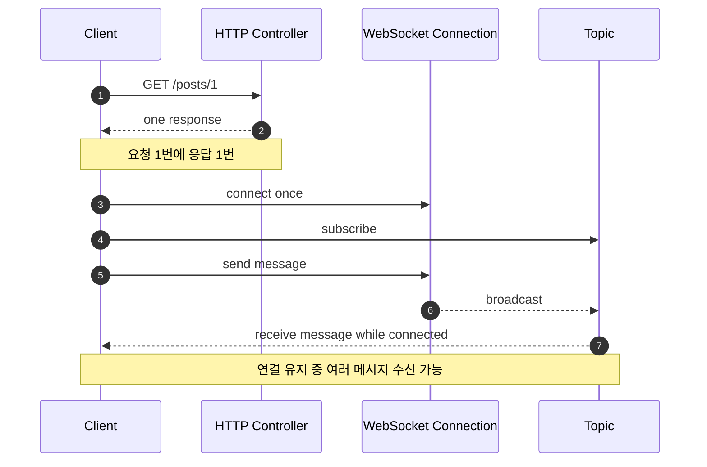
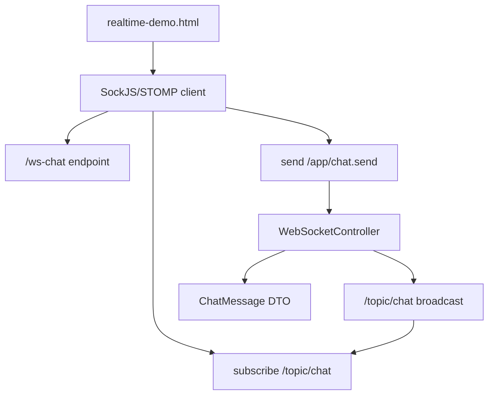

# 이론 정리

> 이번 시퀀스는 HTTP 요청/응답을 넘어 WebSocket과 STOMP로 연결, 구독, 발행, broadcast 흐름을 확인하는 단계입니다.
> 핵심은 채팅 서비스를 크게 만드는 것이 아니라 서버가 연결된 클라이언트에게 다시 메시지를 보내는 가장 작은 흐름을 이해하는 것입니다.

## 1. Problem - 왜 실시간 통신이 필요한가

HTTP는 클라이언트가 요청을 보내고 서버가 응답하는 구조입니다. 게시글 조회, 로그인, 캐시 조회처럼 요청 단위가 분명한 기능에는 이 흐름이 잘 맞습니다.

하지만 채팅이나 알림처럼 서버가 연결된 화면에 다시 메시지를 보내야 하는 기능은 요청/응답 한 번으로 설명하기 어렵습니다. 클라이언트가 계속 새 요청을 보내는 방식으로 흉내 낼 수는 있지만, 연결된 사용자에게 바로 전달되는 흐름을 이해하기에는 한계가 있습니다.

이번 시퀀스에서 해결할 문제는 아래와 같습니다.

- 브라우저가 서버와 연결을 유지합니다.
- 클라이언트가 서버로 메시지를 보냅니다.
- 서버가 받은 메시지를 특정 topic으로 다시 보냅니다.
- topic을 구독 중인 브라우저가 broadcast 메시지를 받습니다.
- `/ws-chat`, `/app/chat.send`, `/topic/chat`의 역할을 구분합니다.

## 2. Analyze - 어떤 경로와 책임을 나눌 것인가

STOMP 흐름에서는 연결 endpoint, 전송 prefix, 구독 topic을 나눠야 합니다. 세 경로를 같은 의미로 보면 메시지가 어디서 시작하고 어디로 돌아오는지 설명하기 어렵습니다.

| 구분 | 역할 | 이번 코드에서 보는 곳 |
|---|---|---|
| 연결 endpoint | 브라우저가 WebSocket/STOMP 연결을 시작하는 지점 | `/ws-chat`, `WebSocketConfig.registerStompEndpoints(...)` |
| application prefix | 클라이언트가 서버 handler로 메시지를 보낼 때 사용하는 prefix | `/app`, `setApplicationDestinationPrefixes(...)` |
| message mapping | 서버 controller 메서드가 받을 실제 목적지 | `/chat.send`, `@MessageMapping` |
| topic prefix | 서버가 구독자에게 메시지를 보낼 때 사용하는 prefix | `/topic`, `enableSimpleBroker(...)` |
| subscribe topic | 클라이언트가 받을 메시지 채널 | `/topic/chat`, `@SendTo` |

이번 시퀀스는 채팅방 관리, 메시지 저장, 읽음 처리, 세션 추적, WebSocket 인증 고급 설정을 다루지 않습니다. 먼저 경로와 DTO, controller 반환 흐름이 연결되는지 확인합니다.

## 3. API / 실행 시퀀스 다이어그램

### 3.1 connect / subscribe / send / receive 흐름

이 흐름에서 중요한 점은 “보내는 경로”와 “받는 경로”가 다르다는 것입니다. 클라이언트는 `/app/chat.send`로 보내고, `/topic/chat`을 구독해 받습니다.

### 3.2 HTTP 요청/응답과 WebSocket 흐름 비교

HTTP와 WebSocket은 경쟁 관계가 아닙니다. 요청/응답이 맞는 기능은 HTTP로 유지하고, 연결된 화면에 서버가 다시 보내야 하는 흐름은 WebSocket으로 이해합니다.

## 4. 계층 / DTO / 메시지 흐름

### 4.1 WebSocket 계층 흐름

| 계층 | 책임 | 직접 확인할 파일 |
|---|---|---|
| Client page | connect, subscribe, send, receive를 화면에서 확인합니다. | `realtime-demo.html` |
| WebSocket config | endpoint, broker prefix, application prefix를 설정합니다. | `WebSocketConfig.kt` |
| Controller | STOMP 메시지를 받고 topic으로 다시 보냅니다. | `WebSocketController.kt` |
| DTO | 실시간 메시지의 모양을 정합니다. | `ChatMessage.kt` |

### 4.2 DTO와 메시지 흐름

| 단계 | 메시지 형태 | 설명 |
|---|---|---|
| 화면 입력 | sender, content | 사용자가 입력한 보낸 사람과 메시지 내용입니다. |
| 클라이언트 send | JSON `ChatMessage` | `/app/chat.send`로 서버에 보냅니다. |
| 서버 수신 | `ChatMessage` 객체 | controller 메서드 파라미터로 받습니다. |
| 서버 반환 | `ChatMessage` 객체 | 같은 메시지를 topic으로 돌려보낼 수 있습니다. |
| 클라이언트 receive | JSON `ChatMessage` | `/topic/chat` 구독자가 화면에 표시합니다. |

## 5. Action - 이번 구현에서 연결할 지점

### 5.1 WebSocket 설정 확인

`WebSocketConfig.kt`에서는 세 가지를 구분합니다. endpoint는 연결 지점이고, `/app`은 서버 handler로 보내는 prefix이며, `/topic`은 구독자에게 메시지를 보내는 broker prefix입니다.

확인 질문:

- 테스트 페이지가 연결하는 endpoint는 어디인가요?
- 클라이언트가 서버로 보낼 때 사용하는 prefix는 무엇인가요?
- 구독자가 메시지를 받을 topic prefix는 무엇인가요?

### 5.2 메시지 controller 연결

`WebSocketController.kt`는 STOMP 메시지를 받는 controller입니다. REST controller처럼 HTTP 응답을 바로 돌려주는 구조가 아니라, STOMP destination과 topic broadcast를 annotation으로 연결합니다.

확인 질문:

- `@MessageMapping`은 클라이언트가 보낸 어떤 경로와 연결되나요?
- `@SendTo`가 가리키는 topic을 구독하는 클라이언트가 있나요?
- 반환값이 구독자에게 전달되는 구조를 말로 설명할 수 있나요?

### 5.3 테스트 페이지 흐름 확인

`realtime-demo.html`은 connect, subscribe, send, receive 순서를 눈으로 확인하는 도구입니다. 실습을 위해 이 페이지와 `/ws-chat/**`은 공개되어 있고, SockJS/STOMP 클라이언트는 jsDelivr CDN에서 로드됩니다. 연결이 완료되기 전에 send를 누르거나 외부 스크립트를 불러오지 못하면 메시지 흐름을 확인할 수 없습니다.

확인 질문:

- connect가 완료된 뒤 subscribe가 시작되나요?
- send 버튼은 `/app/chat.send`로 메시지를 보내나요?
- 수신 영역은 `/topic/chat`에서 받은 메시지를 보여주나요?

## 6. Result - 무엇을 확인하고 어떤 한계가 남는가

이번 시퀀스를 마치면 아래를 설명할 수 있어야 합니다.

- HTTP 요청/응답과 WebSocket 연결 유지 흐름의 차이
- `/ws-chat`, `/app/chat.send`, `/topic/chat`의 역할
- `@MessageMapping`과 `@SendTo`가 이어주는 메시지 흐름
- `ChatMessage` DTO가 서버와 브라우저 사이에서 오가는 방식
- connect, subscribe, send, receive 순서가 필요한 이유

남는 한계도 분명히 봅니다.

- 채팅방 분리, 메시지 저장, 읽음 처리, 사용자 세션 추적은 이번 시퀀스 범위가 아닙니다.
- WebSocket 인증/인가 고급 설정은 이후 확장 대상입니다.
- 현재 목표는 가장 작은 topic broadcast 흐름을 확인하는 것입니다.

## 7. 실무 포인트

- WebSocket은 연결을 유지하므로 연결 상태와 재연결 전략을 함께 고려해야 합니다.
- topic 경로와 send 경로를 섞으면 클라이언트가 보내기만 하고 받지 못할 수 있습니다.
- 메시지를 저장하지 않는 broadcast는 실시간 표시에는 충분할 수 있지만, 이력 조회는 보장하지 않습니다.
- 브라우저 테스트에서는 connect 완료, subscribe 완료, send 순서를 로그로 확인해야 합니다.
- 허용 Origin은 `APP_WEBSOCKET_ALLOWED_ORIGIN_PATTERNS`로 실제 프런트 주소만 지정해야 합니다.
- 실습용 공개 페이지와 `/ws-chat/**` 허용 범위, 외부 CDN 의존은 운영 배포 전에 인증과 고정된 자산 공급 방식으로 다시 설계해야 합니다.

## 8. 용어 정리

### WebSocket

- 뜻
  클라이언트와 서버가 연결을 유지한 채 메시지를 주고받는 통신 방식입니다.
- 왜 중요한가
  서버가 연결된 클라이언트에게 다시 메시지를 보낼 수 있습니다.
- 이번 코드에서는 어디에 보이는가
  `WebSocketConfig.kt`, `/ws-chat`
- 짧은 상황 예시
  브라우저가 `/ws-chat`에 연결한 뒤 메시지를 계속 주고받습니다.

### STOMP

- 뜻
  WebSocket 위에서 메시지 목적지와 구독 흐름을 다루기 위한 메시징 프로토콜입니다.
- 왜 중요한가
  send destination과 subscribe topic을 명확히 나눌 수 있습니다.
- 이번 코드에서는 어디에 보이는가
  `/app`, `/topic`, `@MessageMapping`, `@SendTo`
- 짧은 상황 예시
  클라이언트는 `/app/chat.send`로 보내고 `/topic/chat`을 구독해 받습니다.

### Topic

- 뜻
  여러 구독자가 같은 메시지를 받을 수 있는 메시지 채널입니다.
- 왜 중요한가
  서버가 같은 메시지를 연결된 여러 클라이언트에게 broadcast할 수 있습니다.
- 이번 코드에서는 어디에 보이는가
  `/topic/chat`
- 짧은 상황 예시
  두 브라우저 탭이 같은 topic을 구독하면 한쪽에서 보낸 메시지를 둘 다 받을 수 있습니다.

### Message DTO

- 뜻
  실시간으로 오가는 메시지의 데이터 모양입니다.
- 왜 중요한가
  서버와 브라우저가 같은 필드 이름과 구조로 메시지를 이해해야 합니다.
- 이번 코드에서는 어디에 보이는가
  `ChatMessage.kt`
- 짧은 상황 예시
  `{ "sender": "mentee", "content": "hello" }` 형태의 메시지가 오갑니다.

### Broadcast

- 뜻
  서버가 받은 메시지를 특정 topic 구독자들에게 다시 보내는 흐름입니다.
- 왜 중요한가
  요청한 한 명에게만 응답하는 HTTP와 다르게 여러 연결이 같은 메시지를 받을 수 있습니다.
- 이번 코드에서는 어디에 보이는가
  `@SendTo("/topic/chat")`
- 짧은 상황 예시
  한 브라우저가 메시지를 보내면 topic을 구독 중인 다른 브라우저도 메시지를 받습니다.

## 9. 다음 구현으로 연결되는 지점

`docs/implementation.md`에서는 `WebSocketConfig.kt`의 endpoint/prefix 설정과 `WebSocketController.kt`의 메시지 수신/broadcast 흐름을 연결합니다. 구현 후에는 테스트 페이지에서 connect, subscribe, send, receive가 어떤 순서로 일어나는지 설명해야 합니다.

멘토용 설명 포인트

- 멘티가 `/app`과 `/topic`을 같은 경로로 이해하면 “보내는 경로”와 “구독하는 경로”를 화면 흐름으로 다시 나눠 설명합니다.
- 메시지 저장, 채팅방, 인증 확장으로 범위가 커지면 이번 시퀀스의 목표가 가장 작은 broadcast 흐름 확인임을 되짚습니다.
- 구현 비교 전에는 경로 문자열보다 각 경로의 역할을 먼저 말하게 합니다.

